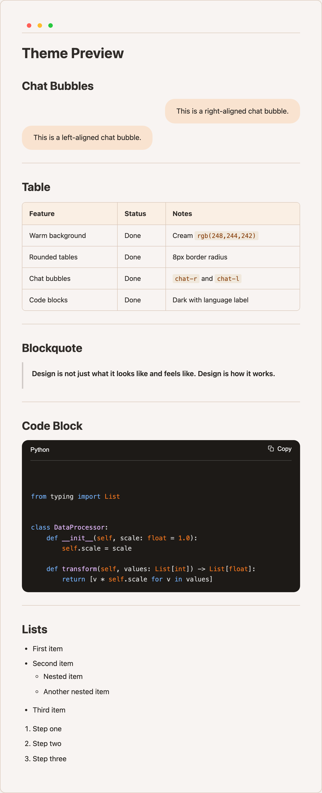

# MS Copilot Theme Plugin

A warm, earthy Obsidian theme with cream backgrounds, brown typography, rounded tables, and chat bubble callouts — bundled as a plugin.

## Why a plugin instead of a pure theme?

Obsidian themes are CSS-only and cannot execute JavaScript. This plugin adds one feature that requires JS:

- **Chat callout outline injection** — parses `> [!chat-r]` and `> [!chat-l]` callouts and injects them as virtual headings into Obsidian's metadata cache, so they appear in the Outline pane (including Quiet Outline).

All theme styling is now dynamically generated from plugin settings, giving full control over colors, sizes, and features without editing CSS.

## Preview

> Click the image to view full size.

<a href="screenshots/preview.png"></a>

## Features

- Warm cream background with dark brown text
- Rounded tables with warm-toned headers
- Dark code blocks with language label and always-visible copy button
- Chat bubble callouts (`chat-r` for right-aligned, `chat-l` for left-aligned)
- Styled inline code, blockquotes, links, and lists
- Chat callouts visible in Outline / Quiet Outline as configurable heading entries
- All visual settings configurable via **Settings > Community plugins > MS Copilot Theme Plugin**

## Settings

Accessible from **Settings > Community plugins > MS Copilot Theme Plugin** (gear icon).

| Group | Options |
|-------|---------|
| **Theme** | Enable/disable theme, markdown background color, code block radius, checkbox strikethrough |
| **Chat Bubbles** | User (chat-r) and response (chat-l) bubble colors, max bubble width |
| **Outline Injection** | Enable/disable injection, per-callout toggle, heading prefix (e.g. "Q:" / "A:"), heading level, max display length |

## Installation

1. Copy the `ms-copilot-theme-plugin` folder into `.obsidian/plugins/`
2. Enable the plugin in **Settings > Community plugins**
3. Set **Settings > Appearance > CSS Theme** to none (the plugin provides all styling)

## Chat Bubble Callouts

Use `[!chat-r]` and `[!chat-l]` for right- and left-aligned chat bubbles:

```markdown
> [!chat-r]
> This appears as a right-aligned bubble.

> [!chat-l]
> This appears as a left-aligned bubble.
```

## Color Palette

Default colors (all configurable via settings):

| Element     | Color                         |
|-------------|-------------------------------|
| Background  | `rgb(248, 244, 242)` cream    |
| Body text   | `rgb(38, 35, 32)` dark brown  |
| Headings    | `rgb(49, 45, 42)` brown       |
| Links       | `#A0522D` saddle brown        |
| Inline code | `#8B4513` on `#F0E8DC`        |
| Borders     | `rgb(217, 199, 184)` warm tan |
| Code blocks | `rgb(29, 26, 23)` dark        |
| Chat bubble | `rgb(249, 227, 208)` peach    |

## License

MIT
