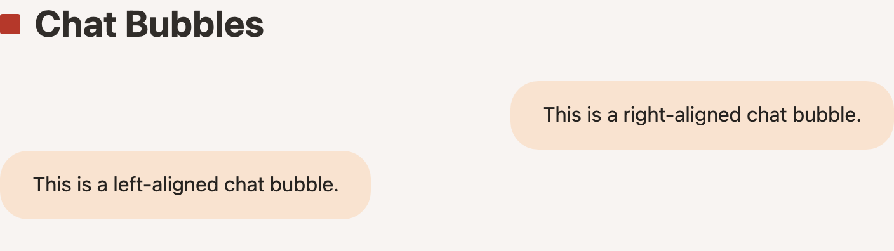
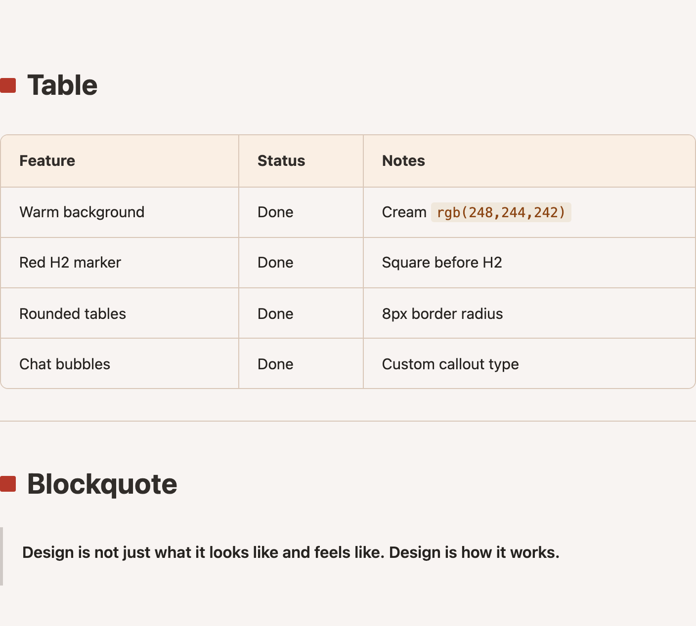
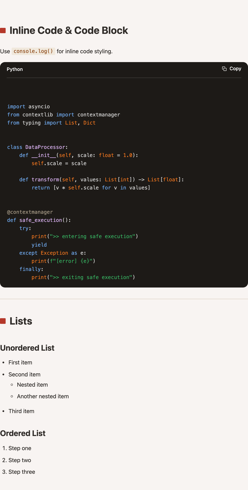

# MS Copilot Theme

A warm, earthy Obsidian theme inspired by Microsoft Copilot's visual style. Features cream backgrounds, brown typography, and a distinctive red square marker on H2 headings.

<table>
  <tr>
    <td><a href="screenshots/chat-bubble.png"></a></td>
    <td><a href="screenshots/headings-typography.png"></a></td>
  </tr>
  <tr>
    <td><a href="screenshots/tables-blockquote.png"></a></td>
    <td><a href="screenshots/code-lists.png"></a></td>
  </tr>
</table>

## Features

- **Warm color palette** — cream backgrounds with dark brown text
- **Red square H2 marker** — distinctive heading decoration
- **Rounded tables** — styled with warm header backgrounds
- **Chat bubble callouts** — `> [!chat-r]` (right-aligned, user requests) and `> [!chat-l]` (left-aligned, responses)
- **Styled code** — inline code and code blocks with warm tones
- **Clean typography** — generous line height and paragraph spacing

## Installation

1. Open Obsidian **Settings** > **Appearance**
2. Under **Themes**, click **Manage**
3. Search for "MS Copilot Theme" and click **Install and use**

### Manual Installation

1. Download `theme.css` and `manifest.json`
2. Create a folder called `ms-copilot-theme` in your vault's `.obsidian/themes/` directory
3. Place both files inside the folder
4. In Obsidian, go to **Settings** > **Appearance** and select **MS Copilot Theme**

## Chat Bubble Callouts

Two callout types for conversational layouts:

```markdown
> [!chat-r]
> Right-aligned bubble (user request)

> [!chat-l]
> Left-aligned bubble (response)
```

## Color Palette

| Element       | Color                         |
|---------------|-------------------------------|
| Background    | `rgb(248, 244, 242)` cream    |
| Body text     | `#3D3229` dark brown          |
| Headings      | `#2C2319` darker brown        |
| H2 marker     | `#B5382A` red                 |
| Links         | `#A0522D` saddle brown        |
| Inline code   | `#8B4513` on `#F0E8DC`        |
| Borders       | `rgb(217, 199, 184)` warm tan |

## License

MIT
